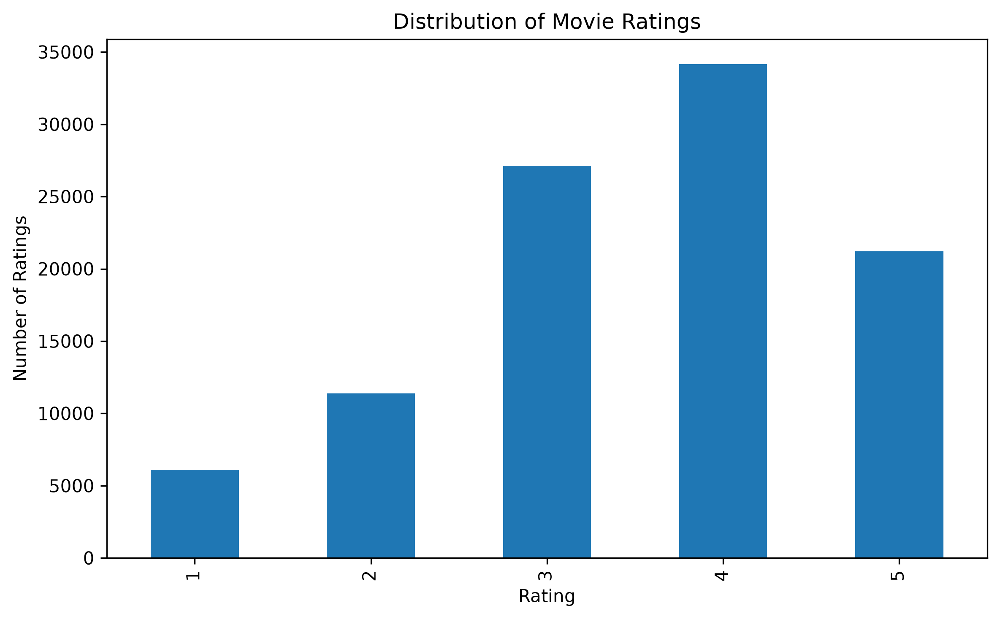
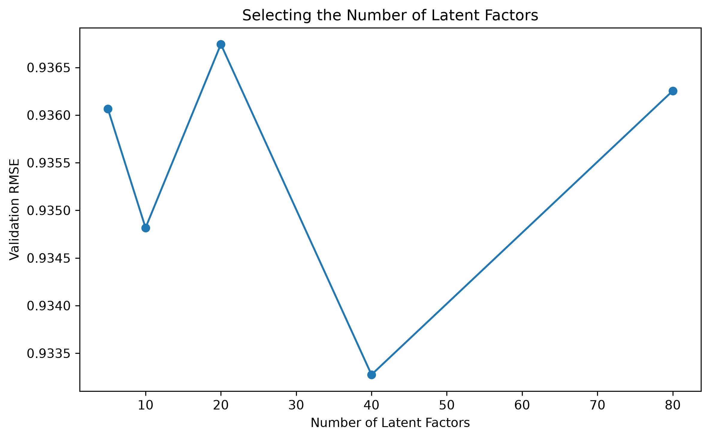
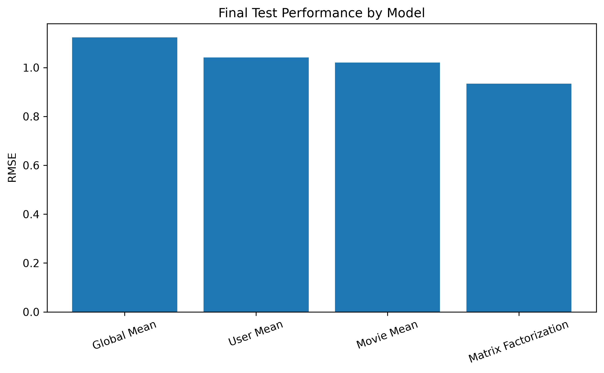

# Personalized Movie Recommendation System

A recommendation system built from scratch using collaborative filtering and matrix factorization on the MovieLens 100K dataset.

This project explores how increasingly sophisticated recommendation techniques improve rating prediction and demonstrates how learned user and movie representations can be used to generate personalized movie recommendations.

## Project Overview

Recommendation systems must infer user preferences from highly incomplete interaction data. The MovieLens 100K dataset is approximately 93.7% sparse, meaning that only about 6.3% of possible user-movie ratings are observed.

This project compares several approaches:

- Global mean baseline
- User mean baseline
- Movie mean baseline
- User-based collaborative filtering
- Mean-centered collaborative filtering
- Matrix factorization implemented from scratch using stochastic gradient descent

The final system uses learned latent representations of users and movies to predict ratings and generate personalized Top-N recommendations.

## Project Highlights

Dataset Rating Distribution

Hyperparameter Selection

Final Model Performance

## Dataset

The project uses the [MovieLens 100K Dataset](https://grouplens.org/datasets/movielens/100k/).

The dataset contains:

- 100,000 ratings
- 943 users
- 1,682 movies
- Ratings from 1 to 5
- 93.7% user-movie matrix sparsity
- Average rating of approximately 3.53

Raw data is excluded from this repository and can be downloaded directly from GroupLens.

## Methodology

### Exploratory Data Analysis

The dataset was analyzed to understand:

- Rating distribution
- User activity
- Movie popularity
- User-movie matrix sparsity

The high sparsity of the rating matrix motivates the use of collaborative filtering and latent-factor approaches.

### Baseline Models

Three simple models were implemented to establish performance benchmarks:

1. Global Mean — predicts the overall average rating
2. User Mean — predicts each user's average rating
3. Movie Mean — predicts each movie's average rating

These baselines provide a reference for determining whether more sophisticated recommendation methods actually improve prediction quality.

### Collaborative Filtering

User-based collaborative filtering was implemented using cosine similarity.

An initial approach compared raw user rating vectors. An improved version mean-centered each user's ratings before calculating similarity, accounting for differences in how users use the rating scale.

The mean-centered approach substantially improved prediction accuracy during exploratory experiments.

### Matrix Factorization

Matrix factorization was implemented from scratch using NumPy and stochastic gradient descent.

The model predicts a rating using:

    r_hat_ui = mu + b_u + b_i + p_u^T q_i

where:

- `mu` is the global average rating
- `b_u` is the user bias
- `b_i` is the movie bias
- `p_u` is the learned user latent vector
- `q_i` is the learned movie latent vector

The model learns compact representations of users and movies directly from observed rating patterns.

L2 regularization is used to reduce overfitting.

## Model Selection

The data was separated into:

- 70% training
- 10% validation
- 20% testing

Hyperparameters were selected using validation performance rather than test performance to prevent test-set leakage.

The final configuration used:

| Hyperparameter | Value |
|---|---:|
| Latent Factors | 40 |
| Learning Rate | 0.005 |
| Regularization | 0.02 |
| Epochs | 20 |

## Results

Final performance was measured on the held-out test set.

| Model | RMSE | MAE |
|---|---:|---:|
| Matrix Factorization | **0.9343** | **0.7349** |
| Movie Mean | 1.0210 | 0.8123 |
| User Mean | 1.0417 | 0.8346 |
| Global Mean | 1.1239 | 0.9420 |

Matrix factorization reduced RMSE by approximately 16.9% compared with the global-mean baseline and approximately 8.5% compared with the strongest simple baseline.

### Top-K Recommendation Evaluation

Using ratings of 4 or greater as relevant items:

| Metric | Result |
|---|---:|
| Precision@10 | 0.0674 |
| Recall@10 | 0.0448 |

These ranking metrics should be interpreted cautiously because MovieLens contains observed ratings rather than complete user preference information. An unrated recommended movie cannot necessarily be considered irrelevant.

## Personalized Recommendations

The final model can predict ratings for movies a user has not previously rated and rank them to generate personalized recommendations.

For example, recommendations generated for User 1 included:

1. Schindler's List (1993)
2. A Close Shave (1995)
3. Secrets & Lies (1996)
4. North by Northwest (1959)
5. Casablanca (1942)
6. One Flew Over the Cuckoo's Nest (1975)
7. Vertigo (1958)
8. The Manchurian Candidate (1962)
9. Dr. Strangelove (1964)
10. Lawrence of Arabia (1962)

## Repository Structure

    movie-recommendation-system/
    |
    |-- data/
    |   |-- raw/
    |   `-- processed/
    |
    |-- notebooks/
    |   |-- 01_exploratory_analysis.ipynb
    |   |-- 02_baseline_models.ipynb
    |   |-- 03_collaborative_filtering.ipynb
    |   |-- 04_matrix_factorization.ipynb
    |   |-- 05_recommendations.ipynb
    |   `-- 06_final_evaluation.ipynb
    |
    |-- src/
    |   `-- matrix_factorization.py
    |
    |-- results/
    |   |-- figures/
    |   `-- tables/
    |
    |-- tests/
    |-- requirements.txt
    |-- .gitignore
    `-- README.md

## Technologies

- Python
- NumPy
- pandas
- scikit-learn
- Matplotlib
- Jupyter
- Git / GitHub

## Key Findings

- Simple user and movie averages substantially outperform a global-average prediction.
- Mean-centering significantly improves user-based collaborative filtering by accounting for differences in individual rating behavior.
- Matrix factorization can represent users and movies with compact learned latent vectors while maintaining strong rating-prediction accuracy.
- Increasing latent dimensionality does not necessarily improve generalization.
- Stronger regularization can cause underfitting and reduce prediction performance.
- Rating prediction and Top-K recommendation ranking are related but distinct objectives.
- Proper separation of training, validation, and test data is important when selecting recommendation-system hyperparameters.

## Limitations and Future Work

Potential extensions include:

- Item-based collaborative filtering
- Temporal train/test splitting
- Improved ranking-oriented evaluation
- Implicit-feedback recommendation methods
- Genre or metadata-based hybrid recommendations
- Cold-start strategies for new users and movies
- Larger MovieLens datasets
- Deployment through an interactive web application

